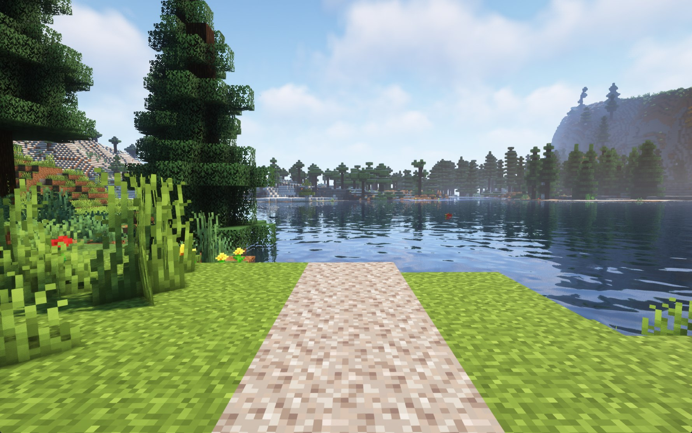

# Run faster on gravel

Get a "Speed II" buff when walking on top of gravel blocks.

The data pack checks for gravel at player y-position -1, so you can also get the speed buff when placing half height blocks on top of the gravel.

